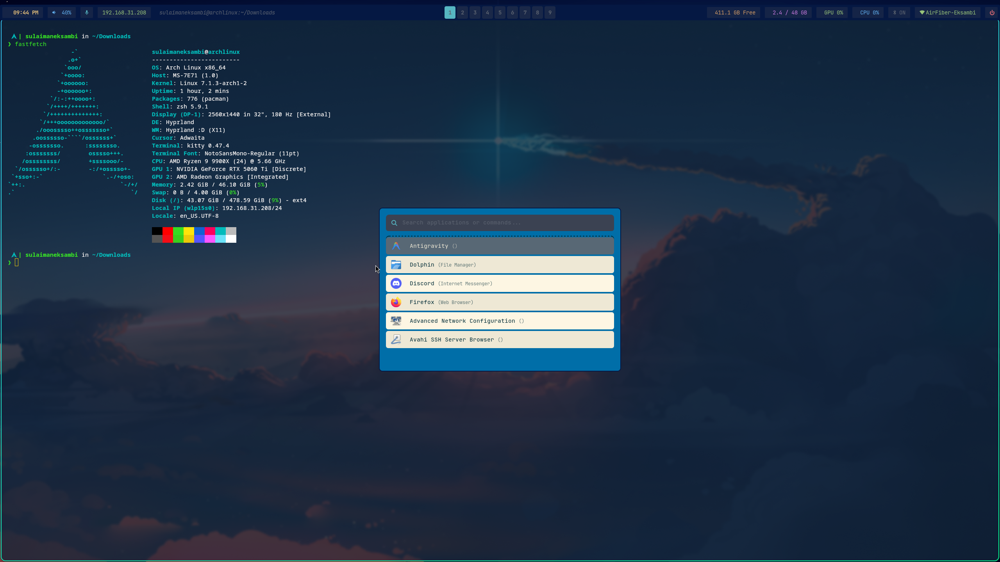

# 🛠️ Dotfiles | Arch Linux + Hyprland

My personal configuration files for an Arch Linux desktop environment powered by Hyprland.

---

## Tech Stack & Applications

| Component | Software |
| :--- | :--- |
| **OS** | Arch Linux |
| **Window Manager** | Hyprland |
| **Terminal** | Kitty |
| **Shell** | Zsh |
| **Prompt** | Starship |
| **Status Bar** | Waybar |
| **App Launcher** | Rofi |

---

## Repository Structure

```text
.
├── kitty/        # Kitty terminal configuration
├── rofi/         # Rofi application launcher themes & configs
├── starship/     # Starship prompt configuration (starship.toml)
├── waybar/       # Waybar bar layout and CSS styling
└── .zshrc        # Zsh shell configuration & aliases
```

## Screenshot 

<p align="center">
  
</p>
